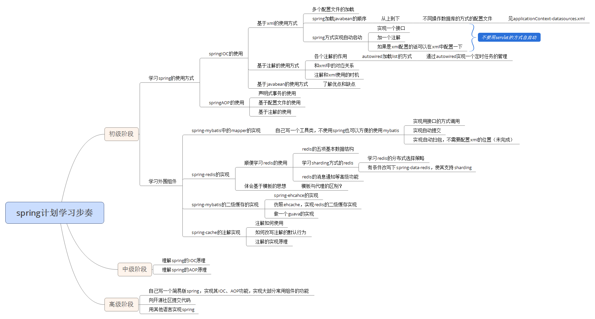

##目标
[spring](https://spring.io/)是一个博大精深的框架，发展到现在spring不仅仅是一个框架,更是一个生态.十多年来无数优秀程序员完善,为其添加功能。

作为一个初入门的程序员,学习spring是一个长远的任务。

##诱因
前段时间接触了一个思维导图软件：[xmind](http://www.xmindchina.net/)。
[mindmanager](http://www.mindmanager.cc/)其实更好用一些，但要收费。土豪可以考虑这个。
无论用什么思维导图，把想法画出来都是一个比较好的总结。
下面是我自己的spring学习路线，还不是很完善，我会不断完善它的。

